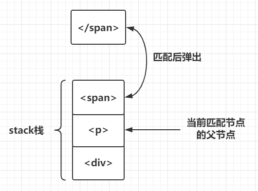

<!--
 * @Description: 
 * @Version: 2.0
 * @Autor: hcl
 * @Date: 2020-06-09 15:12:42
 * @LastEditors: hcl
 * @LastEditTime: 2020-06-18 14:29:13
--> 
## 1、Compile和v-model


*Compile分为三个阶段parse，optimize，generate*
```javascript
/* @flow */
import { parse } from './parser/index'
import { optimize } from './optimizer'
import { generate } from './codegen/index'
import { createCompilerCreator } from './create-compiler'
// `createCompilerCreator` allows creating compilers that use alternative
// parser/optimizer/codegen, e.g the SSR optimizing compiler.
// Here we just export a default compiler using the default parts.
export const createCompiler = createCompilerCreator(function baseCompile (
  template: string,
  options: CompilerOptions
): CompiledResult {
  // 模板解析阶段：用正则等方式解析 template 模板中的指令、class、style等数据，形成AST
  const ast = parse(template.trim(), options)
  if (options.optimize !== false) {
    // 优化阶段：遍历AST，找出其中的静态节点，并打上标记；
    optimize(ast, options)
  }
  // 代码生成阶段：将AST转换成渲染函数；
  const code = generate(ast, options)
  return {
    ast,
    render: code.render,
    staticRenderFns: code.staticRenderFns
  }
})
```


> 第一个阶段parse
> 模板解析阶段：用正则等方式解析 template 模板中的指令、class、style等数据，形成AST


*AST对应的模版*

```javascript
<div class="box"><p>{{msg}}</p></div>
```

如何保证AST节点层级关系

Vue在HTML解析器的开头定义了一个栈stack，这个栈的作用就是用来维护AST节点层级的

```javascript
<div><p><span></span></p></div>
```

>当解析到开始标签div时，就把div推入栈中，然后继续解析，当解析到p时，再把p推入栈中，同理，再把span推入栈中，当解析到结
>束标签span时，此时栈顶的标签刚好是span的开始标签，那么就用span的开始标签和结束标签构建AST节点，并且从栈中把span的开始标签>弹出，那么此时栈中的栈顶标签p就是构建好的span的AST节点的父节点，如下图：




>第二个阶段
>第二个阶段是对AST进行优化，便利AST，找出静态节点和静态根结点


>第三个阶段
> 代码生成阶段：将AST转换成渲染函数；

```javascript
"with(this){return _c('div',{staticClass:"box"},[_c('p',[_v(_s(msg))])])}"
```


## 3、virtual dom和diff算法


VNode树
```javascript
{
    tag: 'div'
    data: {
        class: 'test'
    },
    children: [
        {
            tag: 'span',
            data: {
                class: 'demo'
            }
            text: 'hello,VNode'
        }
    ]
}

```

上面VNode对应的DOM
```html
<div class="test">
    <span class="demo">hello,VNode</span>
</div>
```

## 修改视图
Vue通过数据绑定来修改视图，当某个数据被修改的时候，set方法会让闭包中的Dep调用notify通知所有订阅者Watcher，Watcher通过get方法执行vm._update(vm._render(), hydrating)。

这里看一下_update方法

```JavaScript
Vue.prototype._update = function (vnode: VNode, hydrating?: boolean) {
    const vm: Component = this
    /*如果已经该组件已经挂载过了则代表进入这个步骤是个更新的过程，触发beforeUpdate钩子*/
    if (vm._isMounted) {
      callHook(vm, 'beforeUpdate')
    }
    const prevEl = vm.$el
    const prevVnode = vm._vnode
    const prevActiveInstance = activeInstance
    activeInstance = vm
    vm._vnode = vnode
    // Vue.prototype.__patch__ is injected in entry points
    // based on the rendering backend used.
    /*基于后端渲染Vue.prototype.__patch__被用来作为一个入口*/
    if (!prevVnode) {
      // 初始化
      vm.$el = vm.__patch__(
        vm.$el, vnode, hydrating, false /* removeOnly */,
        vm.$options._parentElm,
        vm.$options._refElm
      )
    } else {
      // 更新
      vm.$el = vm.__patch__(prevVnode, vnode)
    }
    activeInstance = prevActiveInstance
    // update __vue__ reference
    /*更新新的实例对象的__vue__*/
    if (prevEl) {
      prevEl.__vue__ = null
    }
    if (vm.$el) {
      vm.$el.__vue__ = vm
    }
    // if parent is an HOC, update its $el as well
    if (vm.$vnode && vm.$parent && vm.$vnode === vm.$parent._vnode) {
      vm.$parent.$el = vm.$el
    }
    // updated hook is called by the scheduler to ensure that children are
    // updated in a parent's updated hook.
  }
```

_update方法的第一个参数是一个VNode对象，在内部会将该VNode对象与之前旧的VNode对象进行__patch__。

什么是__patch__呢？

## __patch__

patch将新老VNode节点进行比对，然后将根据两者的比较结果进行最小单位地修改视图，而不是将整个视图根据新的VNode重绘。patch的核心在于diff算法，这套算法可以高效地比较virtual DOM的变更，得出变化以修改视图。

那么patch如何工作的呢？

首先说一下patch的核心diff算法，diff算法是通过同层的树节点进行比较而非对树进行逐层搜索遍历的方式，是一种相当高效的算法。


这两张图代表旧的VNode与新VNode进行patch的过程，他们只是在同层级的VNode之间进行比较得到变化（第二张图中相同颜色的方块代表互相进行比较的VNode节点），然后修改变化的视图，所以十分高效。

让我们看一下patch的代码。

patch做的事情：新旧VNode节点判定为同一节点的时候才会进行patchVnode这个过程，否则就是创建新的DOM，移除旧的DOM。

```JavaScript
  /*createPatchFunction的返回值，一个patch函数*/
  return function patch (oldVnode, vnode, hydrating, removeOnly, parentElm, refElm) {
    /*vnode不存在则直接调用销毁钩子*/
    if (isUndef(vnode)) {
      if (isDef(oldVnode)) invokeDestroyHook(oldVnode)
      return
    }

    let isInitialPatch = false
    const insertedVnodeQueue = []

    if (isUndef(oldVnode)) {
      // empty mount (likely as component), create new root element
      /*oldVnode未定义的时候，其实也就是root节点，创建一个新的节点*/
      isInitialPatch = true
      createElm(vnode, insertedVnodeQueue, parentElm, refElm)
    } else {
      /*标记旧的VNode是否有nodeType*/
      const isRealElement = isDef(oldVnode.nodeType)
      if (!isRealElement && sameVnode(oldVnode, vnode)) {
        // patch existing root node
        /*是同一个节点的时候直接修改现有的节点*/
        patchVnode(oldVnode, vnode, insertedVnodeQueue, removeOnly)
      } else {
        if (isRealElement) {
          // mounting to a real element
          // check if this is server-rendered content and if we can perform
          // a successful hydration.
          if (oldVnode.nodeType === 1 && oldVnode.hasAttribute(SSR_ATTR)) {
            /*当旧的VNode是服务端渲染的元素，hydrating记为true*/
            oldVnode.removeAttribute(SSR_ATTR)
            hydrating = true
          }
          if (isTrue(hydrating)) {
            /*需要合并到真实DOM上*/
            if (hydrate(oldVnode, vnode, insertedVnodeQueue)) {
              /*调用insert钩子*/
              invokeInsertHook(vnode, insertedVnodeQueue, true)
              return oldVnode
            } else if (process.env.NODE_ENV !== 'production') {
              warn(
                'The client-side rendered virtual DOM tree is not matching ' +
                'server-rendered content. This is likely caused by incorrect ' +
                'HTML markup, for example nesting block-level elements inside ' +
                '<p>, or missing <tbody>. Bailing hydration and performing ' +
                'full client-side render.'
              )
            }
          }
          // either not server-rendered, or hydration failed.
          // create an empty node and replace it
          /*如果不是服务端渲染或者合并到真实DOM失败，则创建一个空的VNode节点替换它*/
          oldVnode = emptyNodeAt(oldVnode)
        }
        // replacing existing element
        /*取代现有元素*/
        const oldElm = oldVnode.elm
        const parentElm = nodeOps.parentNode(oldElm)
        createElm(
          vnode,
          insertedVnodeQueue,
          // extremely rare edge case: do not insert if old element is in a
          // leaving transition. Only happens when combining transition +
          // keep-alive + HOCs. (#4590)
          oldElm._leaveCb ? null : parentElm,
          nodeOps.nextSibling(oldElm)
        )

        if (isDef(vnode.parent)) {
          // component root element replaced.
          // update parent placeholder node element, recursively
          /*组件根节点被替换，遍历更新父节点element*/
          let ancestor = vnode.parent
          while (ancestor) {
            ancestor.elm = vnode.elm
            ancestor = ancestor.parent
          }
          if (isPatchable(vnode)) {
            /*调用create回调*/
            for (let i = 0; i < cbs.create.length; ++i) {
              cbs.create[i](emptyNode, vnode.parent)
            }
          }
        }

        if (isDef(parentElm)) {
          /*移除老节点*/
          removeVnodes(parentElm, [oldVnode], 0, 0)
        } else if (isDef(oldVnode.tag)) {
          /*Github:https://github.com/answershuto*/
          /*调用destroy钩子*/
          invokeDestroyHook(oldVnode)
        }
      }
    }

    /*调用insert钩子*/
    invokeInsertHook(vnode, insertedVnodeQueue, isInitialPatch)
    return vnode.elm
  }
```

怎么样的节点算sameVnode呢？

## sameVnode

我们来看一下sameVnode的实现。

```JavaScript
/*
  判断两个VNode节点是否是同一个节点，需要满足以下条件
  key相同
  tag（当前节点的标签名）相同
  isComment（是否为注释节点）相同
  是否data（当前节点对应的对象，包含了具体的一些数据信息，是一个VNodeData类型，可以参考VNodeData类型中的数据信息）都有定义
  当标签是<input>的时候，type必须相同
*/
function sameVnode (a, b) {
  return (
    a.key === b.key &&
    a.tag === b.tag &&
    a.isComment === b.isComment &&
    isDef(a.data) === isDef(b.data) &&
    sameInputType(a, b)
  )
}

// Some browsers do not support dynamically changing type for <input>
// so they need to be treated as different nodes
/*
  判断当标签是<input>的时候，type是否相同
  某些浏览器不支持动态修改<input>类型，所以他们被视为不同节点
*/
function sameInputType (a, b) {
  if (a.tag !== 'input') return true
  let i
  const typeA = isDef(i = a.data) && isDef(i = i.attrs) && i.type
  const typeB = isDef(i = b.data) && isDef(i = i.attrs) && i.type
  return typeA === typeB
}
```

当两个VNode的tag、key、isComment都相同，并且同时定义或未定义data的时候，且如果标签为input则type必须相同。这时候这两个VNode则算sameVnode，可以直接进行patchVnode操作。

## patchVnode

patchVnode的规则是这样的：

1.如果新旧VNode都是静态的，同时它们的key相同（代表同一节点），并且新的VNode是clone或者是标记了once（标记v-once属性，只渲染一次），那么只需要替换elm以及componentInstance即可。

2.新老节点均有children子节点，则对子节点进行diff操作，调用updateChildren，这个updateChildren也是diff的核心。

3.如果老节点没有子节点而新节点存在子节点，先清空老节点DOM的文本内容，然后为当前DOM节点加入子节点。

4.当新节点没有子节点而老节点有子节点的时候，则移除该DOM节点的所有子节点。

5.当新老节点都无子节点的时候，只是文本的替换。

看一下patchVnode的代码。

```JavaScript
  /*patch VNode节点*/
  function patchVnode (oldVnode, vnode, insertedVnodeQueue, removeOnly) {
    /*两个VNode节点相同则直接返回*/
    if (oldVnode === vnode) {
      return
    }
    // reuse element for static trees.
    // note we only do this if the vnode is cloned -
    // if the new node is not cloned it means the render functions have been
    // reset by the hot-reload-api and we need to do a proper re-render.
    /*
      如果新旧VNode都是静态的，同时它们的key相同（代表同一节点），
      并且新的VNode是clone或者是标记了once（标记v-once属性，只渲染一次），
      那么只需要替换elm以及componentInstance即可。
    */
    if (isTrue(vnode.isStatic) &&
        isTrue(oldVnode.isStatic) &&
        vnode.key === oldVnode.key &&
        (isTrue(vnode.isCloned) || isTrue(vnode.isOnce))) {
      vnode.elm = oldVnode.elm
      vnode.componentInstance = oldVnode.componentInstance
      return
    }
    let i
    const data = vnode.data
    if (isDef(data) && isDef(i = data.hook) && isDef(i = i.prepatch)) {
      /*i = data.hook.prepatch，如果存在的话，见"./create-component componentVNodeHooks"。*/
      i(oldVnode, vnode)
    }
    const elm = vnode.elm = oldVnode.elm
    const oldCh = oldVnode.children
    const ch = vnode.children
    if (isDef(data) && isPatchable(vnode)) {
      /*调用update回调以及update钩子*/
      for (i = 0; i < cbs.update.length; ++i) cbs.update[i](oldVnode, vnode)
      if (isDef(i = data.hook) && isDef(i = i.update)) i(oldVnode, vnode)
    }
    /*如果这个VNode节点没有text文本时*/
    if (isUndef(vnode.text)) {
      if (isDef(oldCh) && isDef(ch)) {
        /*新老节点均有children子节点，则对子节点进行diff操作，调用updateChildren*/
        if (oldCh !== ch) updateChildren(elm, oldCh, ch, insertedVnodeQueue, removeOnly)
      } else if (isDef(ch)) {
        /*如果老节点没有子节点而新节点存在子节点，先清空elm的文本内容，然后为当前节点加入子节点*/
        if (isDef(oldVnode.text)) nodeOps.setTextContent(elm, '')
        addVnodes(elm, null, ch, 0, ch.length - 1, insertedVnodeQueue)
      } else if (isDef(oldCh)) {
        /*当新节点没有子节点而老节点有子节点的时候，则移除所有ele的子节点*/
        removeVnodes(elm, oldCh, 0, oldCh.length - 1)
      } else if (isDef(oldVnode.text)) {
        /*当新老节点都无子节点的时候，只是文本的替换，因为这个逻辑中新节点text不存在，所以直接去除ele的文本*/
        nodeOps.setTextContent(elm, '')
      }
    } else if (oldVnode.text !== vnode.text) {
      /*当新老节点text不一样时，直接替换这段文本*/
      nodeOps.setTextContent(elm, vnode.text)
    }
    /*调用postpatch钩子*/
    if (isDef(data)) {
      if (isDef(i = data.hook) && isDef(i = i.postpatch)) i(oldVnode, vnode)
    }
  }
```

## updateChildren

```JavaScript
  function updateChildren (parentElm, oldCh, newCh, insertedVnodeQueue, removeOnly) {
    let oldStartIdx = 0
    let newStartIdx = 0
    let oldEndIdx = oldCh.length - 1
    let oldStartVnode = oldCh[0]
    let oldEndVnode = oldCh[oldEndIdx]
    let newEndIdx = newCh.length - 1
    let newStartVnode = newCh[0]
    let newEndVnode = newCh[newEndIdx]
    let oldKeyToIdx, idxInOld, elmToMove, refElm

    // removeOnly is a special flag used only by <transition-group>
    // to ensure removed elements stay in correct relative positions
    // during leaving transitions
    const canMove = !removeOnly

    while (oldStartIdx <= oldEndIdx && newStartIdx <= newEndIdx) {
      if (isUndef(oldStartVnode)) {
        oldStartVnode = oldCh[++oldStartIdx] // // 如果oldStartVnode不存在，则直接跳过，比对下一个
      } else if (isUndef(oldEndVnode)) {
        oldEndVnode = oldCh[--oldEndIdx]
      } else if (sameVnode(oldStartVnode, newStartVnode)) {
        /*前四种情况其实是指定key的时候，判定为同一个VNode，则直接patchVnode即可，分别比较oldCh以及newCh的两头节点2*2=4种情况*/
        patchVnode(oldStartVnode, newStartVnode, insertedVnodeQueue)
        oldStartVnode = oldCh[++oldStartIdx]
        newStartVnode = newCh[++newStartIdx]
      } else if (sameVnode(oldEndVnode, newEndVnode)) {
        patchVnode(oldEndVnode, newEndVnode, insertedVnodeQueue)
        oldEndVnode = oldCh[--oldEndIdx]
        newEndVnode = newCh[--newEndIdx]
      } else if (sameVnode(oldStartVnode, newEndVnode)) { // Vnode moved right
        patchVnode(oldStartVnode, newEndVnode, insertedVnodeQueue)
        canMove && nodeOps.insertBefore(parentElm, oldStartVnode.elm, nodeOps.nextSibling(oldEndVnode.elm))
        oldStartVnode = oldCh[++oldStartIdx]
        newEndVnode = newCh[--newEndIdx]
      } else if (sameVnode(oldEndVnode, newStartVnode)) { // Vnode moved left
        patchVnode(oldEndVnode, newStartVnode, insertedVnodeQueue)
        canMove && nodeOps.insertBefore(parentElm, oldEndVnode.elm, oldStartVnode.elm)
        oldEndVnode = oldCh[--oldEndIdx]
        newStartVnode = newCh[++newStartIdx]
      } else {
        /*
          生成一个key与旧VNode的key对应的哈希表（只有第一次进来undefined的时候会生成，也为后面检测重复的key值做铺垫）
          比如childre是这样的 [{xx: xx, key: 'key0'}, {xx: xx, key: 'key1'}, {xx: xx, key: 'key2'}]  beginIdx = 0   endIdx = 2  
          结果生成{key0: 0, key1: 1, key2: 2}
        */
        if (isUndef(oldKeyToIdx)) oldKeyToIdx = createKeyToOldIdx(oldCh, oldStartIdx, oldEndIdx)
        /*如果newStartVnode新的VNode节点存在key并且这个key在oldVnode中能找到则返回这个节点的idxInOld（即第几个节点，下标）*/
        idxInOld = isDef(newStartVnode.key) ? oldKeyToIdx[newStartVnode.key] : null
        if (isUndef(idxInOld)) { // New element
          /*newStartVnode没有key或者是该key没有在老节点中找到则创建一个新的节点*/
          createElm(newStartVnode, insertedVnodeQueue, parentElm, oldStartVnode.elm)
          newStartVnode = newCh[++newStartIdx]
        } else {
          /*获取同key的老节点*/
          elmToMove = oldCh[idxInOld]
          /* istanbul ignore if */
          if (process.env.NODE_ENV !== 'production' && !elmToMove) {
            /*如果elmToMove不存在说明之前已经有新节点放入过这个key的DOM中，提示可能存在重复的key，确保v-for的时候item有唯一的key值*/
            warn(
              'It seems there are duplicate keys that is causing an update error. ' +
              'Make sure each v-for item has a unique key.'
            )
          }
          if (sameVnode(elmToMove, newStartVnode)) {
            /*如果新VNode与得到的有相同key的节点是同一个VNode则进行patchVnode*/
            patchVnode(elmToMove, newStartVnode, insertedVnodeQueue)
            /*因为已经patchVnode进去了，所以将这个老节点赋值undefined，之后如果还有新节点与该节点key相同可以检测出来提示已有重复的key*/
            oldCh[idxInOld] = undefined
            /*当有标识位canMove实可以直接插入oldStartVnode对应的真实DOM节点前面*/
            canMove && nodeOps.insertBefore(parentElm, newStartVnode.elm, oldStartVnode.elm)
            newStartVnode = newCh[++newStartIdx]
          } else {
            // same key but different element. treat as new element
            /*当新的VNode与找到的同样key的VNode不是sameVNode的时候（比如说tag不一样或者是有不一样type的input标签），创建一个新的节点*/
            createElm(newStartVnode, insertedVnodeQueue, parentElm, oldStartVnode.elm)
            newStartVnode = newCh[++newStartIdx]
          }
        }
      }
    }
    if (oldStartIdx > oldEndIdx) {
      /*全部比较完成以后，发现oldStartIdx > oldEndIdx的话，说明老节点已经遍历完了，新节点比老节点多，所以这时候多出来的新节点需要一个一个创建出来加入到真实DOM中*/
      refElm = isUndef(newCh[newEndIdx + 1]) ? null : newCh[newEndIdx + 1].elm
      addVnodes(parentElm, refElm, newCh, newStartIdx, newEndIdx, insertedVnodeQueue)
    } else if (newStartIdx > newEndIdx) {
      /*如果全部比较完成以后发现newStartIdx > newEndIdx，则说明新节点已经遍历完了，老节点多余新节点，这个时候需要将多余的老节点从真实DOM中移除*/
      removeVnodes(parentElm, oldCh, oldStartIdx, oldEndIdx)
    }
  }
```

直接看源码可能比较难以捋清其中的关系，我们通过图来看一下。


首先，在新老两个VNode节点的左右头尾两侧都有一个变量标记，在遍历过程中这几个变量都会向中间靠拢。当oldStartIdx > oldEndIdx或者newStartIdx > newEndIdx时结束循环。

索引与VNode节点的对应关系：
oldStartIdx => oldStartVnode
oldEndIdx => oldEndVnode
newStartIdx => newStartVnode
newEndIdx => newEndVnode

在遍历中，如果存在key，并且满足sameVnode，会将该DOM节点进行复用，否则则会创建一个新的DOM节点。

首先，oldStartVnode、oldEndVnode与newStartVnode、newEndVnode两两比较一共有2*2=4种比较方法。

当新老VNode节点的start或者end满足sameVnode时，也就是sameVnode(oldStartVnode, newStartVnode)或者sameVnode(oldEndVnode, newEndVnode)，直接将该VNode节点进行patchVnode即可。


如果oldStartVnode与newEndVnode满足sameVnode，即sameVnode(oldStartVnode, newEndVnode)。

这时候说明oldStartVnode已经跑到了oldEndVnode后面去了，进行patchVnode的同时还需要将真实DOM节点移动到oldEndVnode的后面。


如果oldEndVnode与newStartVnode满足sameVnode，即sameVnode(oldEndVnode, newStartVnode)。

这说明oldEndVnode跑到了oldStartVnode的前面，进行patchVnode的同时真实的DOM节点移动到了oldStartVnode的前面。


如果以上情况均不符合，则通过createKeyToOldIdx会得到一个oldKeyToIdx，里面存放了一个key为旧的VNode，value为对应index序列的哈希表。从这个哈希表中可以找到是否有与newStartVnode一致key的旧的VNode节点，如果同时满足sameVnode，patchVnode的同时会将这个真实DOM（elmToMove）移动到oldStartVnode对应的真实DOM的前面。


当然也有可能newStartVnode在旧的VNode节点找不到一致的key，或者是即便key相同却不是sameVnode，这个时候会调用createElm创建一个新的DOM节点。


到这里循环已经结束了，那么剩下我们还需要处理多余或者不够的真实DOM节点。

1.当结束时oldStartIdx > oldEndIdx，这个时候老的VNode节点已经遍历完了，但是新的节点还没有。说明了新的VNode节点实际上比老的VNode节点多，也就是比真实DOM多，需要将剩下的（也就是新增的）VNode节点插入到真实DOM节点中去，此时调用addVnodes（批量调用createElm的接口将这些节点加入到真实DOM中去）。


2。同理，当newStartIdx > newEndIdx时，新的VNode节点已经遍历完了，但是老的节点还有剩余，说明真实DOM节点多余了，需要从文档中删除，这时候调用removeVnodes将这些多余的真实DOM删除。


## 4、Vue.js异步更新DOM策略及nextTick

```html
<template>
  <div>
    <div ref="test">{{test}}</div>
    <button @click="handleClick">tet</button>
  </div>
</template>

```

```javascript
export default {
    data () {
        return {
            test: 'begin'
        };
    },
    methods () {
        handleClick () {
            this.$nextTick(() => {
                console.log(this.test)
                console.log(this.$refs.test.innerText);
            });
            this.test = 'end';
            this.$nextTick(() => {
                console.log(this.$refs.test.innerText)
            });
            console.log(this.$refs.test.innerText)
        }
    }
}
```


## Watcher队列

带着疑问，我们找到了Vue.js源码的Watch实现。当某个响应式数据发生变化的时候，它的setter函数会通知闭包中的Dep，Dep则会调用它管理的所有Watch对象。触发Watch对象的update实现。我们来看一下update的实现。

```javascript
update () {
    /* istanbul ignore else */
    if (this.lazy) {
        this.dirty = true
    } else if (this.sync) {
        /*同步则执行run直接渲染视图*/
        this.run()
    } else {
        /*异步推送到观察者队列中，下一个tick时调用。*/
        queueWatcher(this)
    }
}
```

我们发现Vue.js默认是使用异步执行DOM更新
当异步执行update的时候，会调用queueWatcher函数。

```javascript
 /*将一个观察者对象push进观察者队列，在队列中已经存在相同的id则该观察者对象将被跳过，除非它是在队列被刷新时推送*/
export function queueWatcher (watcher: Watcher) {
  /*获取watcher的id*/
  const id = watcher.id
  /*检验id是否存在，已经存在则直接跳过，不存在则标记哈希表has，用于下次检验*/
  if (has[id] == null) {
    has[id] = true
    if (!flushing) {
      /*如果没有flush掉，直接push到队列中即可*/
      queue.push(watcher)
    } else {
      // if already flushing, splice the watcher based on its id
      // if already past its id, it will be run next immediately.
      let i = queue.length - 1
      while (i >= 0 && queue[i].id > watcher.id) {
        i--
      }
      queue.splice(Math.max(i, index) + 1, 0, watcher)
    }
    // queue the flush
    if (!waiting) {
      waiting = true
      nextTick(flushSchedulerQueue)
    }
  }
}
```

查看queueWatcher的源码我们发现，Watch对象并不是立即更新视图，而是被push进了一个队列queue，此时状态处于waiting的状态，这时候会继续会有Watch对象被push进这个队列queue，等到下一个tick运行时，这些Watch对象才会被遍历取出，更新视图。同时，id重复的Watcher不会被多次加入到queue中去，因为在最终渲染时，我们只需要关心数据的最终结果。

那么，什么是下一个tick？

## nextTick

vue.js提供了一个nextTick函数，其实也就是上面调用的nextTick。

nextTick的实现比较简单，执行的目的是在microtask或者task中推入一个function，在当前栈执行完毕（也许还会有一些排在前面的需要执行的任务）以后执行nextTick传入的function，看一下源码：

```javascript
/**
 * Defer a task to execute it asynchronously.
 */
 /*
    延迟一个任务使其异步执行，在下一个tick时执行，一个立即执行函数，返回一个function
    这个函数的作用是在task或者microtask中推入一个timerFunc，在当前调用栈执行完以后以此执行直到执行到timerFunc
    目的是延迟到当前调用栈执行完以后执行
*/
export const nextTick = (function () {
  /*存放异步执行的回调*/
  const callbacks = []
  /*一个标记位，如果已经有timerFunc被推送到任务队列中去则不需要重复推送*/
  let pending = false
  /*一个函数指针，指向函数将被推送到任务队列中，等到主线程任务执行完时，任务队列中的timerFunc被调用*/
  let timerFunc

  /*下一个tick时的回调*/
  function nextTickHandler () {
    /*一个标记位，标记等待状态（即函数已经被推入任务队列或者主线程，已经在等待当前栈执行完毕去执行），这样就不需要在push多个回调到callbacks时将timerFunc多次推入任务队列或者主线程*/
    pending = false
    /*执行所有callback*/
    const copies = callbacks.slice(0)
    callbacks.length = 0
    for (let i = 0; i < copies.length; i++) {
      copies[i]()
    }
  }

  // the nextTick behavior leverages the microtask queue, which can be accessed
  // via either native Promise.then or MutationObserver.
  // MutationObserver has wider support, however it is seriously bugged in
  // UIWebView in iOS >= 9.3.3 when triggered in touch event handlers. It
  // completely stops working after triggering a few times... so, if native
  // Promise is available, we will use it:
  /* istanbul ignore if */

  /*
    这里解释一下，一共有Promise、MutationObserver以及setTimeout三种尝试得到timerFunc的方法
    优先使用Promise，在Promise不存在的情况下使用MutationObserver，这两个方法都会在microtask中执行，会比setTimeout更早执行，所以优先使用。
    如果上述两种方法都不支持的环境则会使用setTimeout，在task尾部推入这个函数，等待调用执行。
    参考：https://www.zhihu.com/question/55364497
  */
  if (typeof Promise !== 'undefined' && isNative(Promise)) {
    /*使用Promise*/
    var p = Promise.resolve()
    var logError = err => { console.error(err) }
    timerFunc = () => {
      p.then(nextTickHandler).catch(logError)
      // in problematic UIWebViews, Promise.then doesn't completely break, but
      // it can get stuck in a weird state where callbacks are pushed into the
      // microtask queue but the queue isn't being flushed, until the browser
      // needs to do some other work, e.g. handle a timer. Therefore we can
      // "force" the microtask queue to be flushed by adding an empty timer.
      if (isIOS) setTimeout(noop)
    }
  } else if (typeof MutationObserver !== 'undefined' && (
    isNative(MutationObserver) ||
    // PhantomJS and iOS 7.x
    MutationObserver.toString() === '[object MutationObserverConstructor]'
  )) {
    // use MutationObserver where native Promise is not available,
    // e.g. PhantomJS IE11, iOS7, Android 4.4
    /*新建一个textNode的DOM对象，用MutationObserver绑定该DOM并指定回调函数，在DOM变化的时候则会触发回调,该回调会进入主线程（比任务队列优先执行），即textNode.data = String(counter)时便会触发回调*/
    var counter = 1
    var observer = new MutationObserver(nextTickHandler)
    var textNode = document.createTextNode(String(counter))
    observer.observe(textNode, {
      characterData: true
    })
    timerFunc = () => {
      counter = (counter + 1) % 2
      textNode.data = String(counter)
    }
  } else {
    // fallback to setTimeout
    /* istanbul ignore next */
    /*使用setTimeout将回调推入任务队列尾部*/
    timerFunc = () => {
      setTimeout(nextTickHandler, 0)
    }
  }

  /*
    推送到队列中下一个tick时执行
    cb 回调函数
    ctx 上下文
  */
  return function queueNextTick (cb?: Function, ctx?: Object) {
    let _resolve
    /*cb存到callbacks中*/
    callbacks.push(() => {
      if (cb) {
        try {
          cb.call(ctx)
        } catch (e) {
          handleError(e, ctx, 'nextTick')
        }
      } else if (_resolve) {
        _resolve(ctx)
      }
    })
    if (!pending) {
      pending = true
      timerFunc()
    }
    if (!cb && typeof Promise !== 'undefined') {
      return new Promise((resolve, reject) => {
        _resolve = resolve
      })
    }
  }
})()
```

它是一个立即执行函数,返回一个queueNextTick接口。

传入的cb会被push进callbacks中存放起来，然后执行timerFunc（pending是一个状态标记，保证timerFunc在下一个tick之前只执行一次）。

timerFunc是什么？

看了源码发现timerFunc会检测当前环境而不同实现，其实就是按照Promise，MutationObserver，setTimeout优先级，哪个存在使用哪个，最不济的环境下使用setTimeout。

这里解释一下，一共有Promise、MutationObserver以及setTimeout三种尝试得到timerFunc的方法。
优先使用Promise，在Promise不存在的情况下使用MutationObserver，这两个方法的回调函数都会在microtask中执行，它们会比setTimeout更早执行，所以优先使用。
如果上述两种方法都不支持的环境则会使用setTimeout，在task尾部推入这个函数，等待调用执行。

为什么要优先使用microtask？我在顾轶灵在知乎的回答中学习到：

```
JS 的 event loop 执行时会区分 task 和 microtask，引擎在每个 task 执行完毕，从队列中取下一个 task 来执行之前，会先执行完所有 microtask 队列中的 microtask。
setTimeout 回调会被分配到一个新的 task 中执行，而 Promise 的 resolver、MutationObserver 的回调都会被安排到一个新的 microtask 中执行，会比 setTimeout 产生的 task 先执行。
要创建一个新的 microtask，优先使用 Promise，如果浏览器不支持，再尝试 MutationObserver。
实在不行，只能用 setTimeout 创建 task 了。
为啥要用 microtask？
根据 HTML Standard，在每个 task 运行完以后，UI 都会重渲染，那么在 microtask 中就完成数据更新，当前 task 结束就可以得到最新的 UI 了。
反之如果新建一个 task 来做数据更新，那么渲染就会进行两次。

```

首先是Promise，Promise.resolve().then()可以在microtask中加入它的回调，

MutationObserver新建一个textNode的DOM对象，用MutationObserver绑定该DOM并指定回调函数，在DOM变化的时候则会触发回调,该回调会进入microtask，即textNode.data = String(counter)时便会加入该回调。

setTimeout是最后的一种备选方案，它会将回调函数加入task中，等到执行。

综上，nextTick的目的就是产生一个回调函数加入task或者microtask中，当前栈执行完以后（可能中间还有别的排在前面的函数）调用该回调函数，起到了异步触发（即下一个tick时触发）的目的。

## flushSchedulerQueue

```javascript
/*Github:https://github.com/answershuto*/
/**
 * Flush both queues and run the watchers.
 */
 /*nextTick的回调函数，在下一个tick时flush掉两个队列同时运行watchers*/
function flushSchedulerQueue () {
  flushing = true
  let watcher, id

  // Sort queue before flush.
  // This ensures that:
  // 1. Components are updated from parent to child. (because parent is always
  //    created before the child)
  // 2. A component's user watchers are run before its render watcher (because
  //    user watchers are created before the render watcher)
  // 3. If a component is destroyed during a parent component's watcher run,
  //    its watchers can be skipped.
  /*
    给queue排序，这样做可以保证：
    1.组件更新的顺序是从父组件到子组件的顺序，因为父组件总是比子组件先创建。
    2.一个组件的user watchers比render watcher先运行，因为user watchers往往比render watcher更早创建
    3.如果一个组件在父组件watcher运行期间被销毁，它的watcher执行将被跳过。
  */
  queue.sort((a, b) => a.id - b.id)

  // do not cache length because more watchers might be pushed
  // as we run existing watchers
  /*这里不用index = queue.length;index > 0; index--的方式写是因为不要将length进行缓存，因为在执行处理现有watcher对象期间，更多的watcher对象可能会被push进queue*/
  for (index = 0; index < queue.length; index++) {
    watcher = queue[index]
    id = watcher.id
    /*将has的标记删除*/
    has[id] = null
    /*执行watcher*/
    watcher.run()
    // in dev build, check and stop circular updates.
    /*
      在测试环境中，检测watch是否在死循环中
      比如这样一种情况
      watch: {
        test () {
          this.test++;
        }
      }
      持续执行了一百次watch代表可能存在死循环
    */
    if (process.env.NODE_ENV !== 'production' && has[id] != null) {
      circular[id] = (circular[id] || 0) + 1
      if (circular[id] > MAX_UPDATE_COUNT) {
        warn(
          'You may have an infinite update loop ' + (
            watcher.user
              ? `in watcher with expression "${watcher.expression}"`
              : `in a component render function.`
          ),
          watcher.vm
        )
        break
      }
    }
  }

  // keep copies of post queues before resetting state
  /**/
  /*得到队列的拷贝*/
  const activatedQueue = activatedChildren.slice()
  const updatedQueue = queue.slice()

  /*重置调度者的状态*/
  resetSchedulerState()

  // call component updated and activated hooks
  /*使子组件状态都改编成active同时调用activated钩子*/
  callActivatedHooks(activatedQueue)
  /*调用updated钩子*/
  callUpdateHooks(updatedQueue)

  // devtool hook
  /* istanbul ignore if */
  if (devtools && config.devtools) {
    devtools.emit('flush')
  }
}
```

flushSchedulerQueue是下一个tick时的回调函数，主要目的是执行Watcher的run函数，用来更新视图 

## 为什么要异步更新视图

来看一下下面这一段代码

```html
<template>
  <div>
    <div>{{test}}</div>
  </div>
</template>

```

```javascript
export default {
    data () {
        return {
            test: 0
        };
    },
    mounted () {
      for(let i = 0; i < 1000; i++) {
        this.test++;
      }
    }
}
```

现在有这样的一种情况，mounted的时候test的值会被++循环执行1000次。
每次++时，都会根据响应式触发setter->Dep->Watcher->update->patch。
如果这时候没有异步更新视图，那么每次++都会直接操作DOM更新视图，这是非常消耗性能的。
所以Vue.js实现了一个queue队列，在下一个tick的时候会统一执行queue中Watcher的run。同时，拥有相同id的Watcher不会被重复加入到该queue中去，所以不会执行1000次Watcher的run。最终更新视图只会直接将test对应的DOM的0变成1000。
保证更新视图操作DOM的动作是在当前栈执行完以后下一个tick的时候调用，大大优化了性能。

## 访问真实DOM节点更新后的数据

```html
<template>
  <div>
    <div ref="test">{{test}}</div>
    <button @click="handleClick">tet</button>
  </div>
</template>

```

```javascript
export default {
    data () {
        return {
            test: 'begin'
        };
    },
    methods () {
        handleClick () {
            this.$nextTick(() => {
                console.log(this.test)
                console.log(this.$refs.test.innerText);
            });
            this.test = 'end';
            this.$nextTick(() => {
                console.log(this.$refs.test.innerText)
            });
            console.log(this.$refs.test.innerText)
        }
    }
}
```


