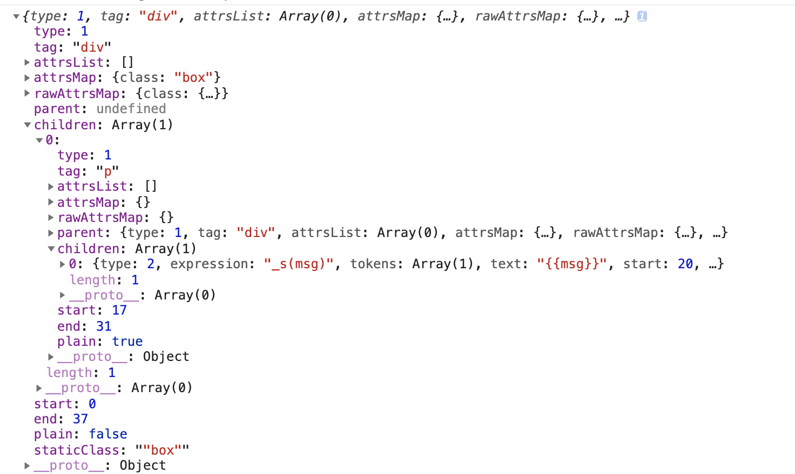

<!--
 * @Description: 
 * @Version: 2.0
 * @Autor: hcl
 * @Date: 2020-06-09 15:12:42
 * @LastEditors: hcl
 * @LastEditTime: 2020-06-09 15:48:45
--> 
## 1、Compile


*Compile分为三个阶段parse，optimize，generate*

> 第一个阶段parse
> 模板解析阶段：用正则等方式解析 template 模板中的指令、class、style等数据，形成AST



*AST对应的模版*

```javascript
<div class="box"><p>{{msg}}</p></div>
```

>如何保证AST节点层级关系
>Vue在HTML解析器的开头定义了一个栈stack，这个栈的作用就是用来维护AST节点层级的

```javascript
<div><p><span></span></p></div>
```

>当解析到开始标签<div>时，就把div推入栈中，然后继续解析，当解析到<p>时，再把p推入栈中，同理，再把span推入栈中，当解析到结>>束标签</span>时，此时栈顶的标签刚好是span的开始标签，那么就用span的开始标签和结束标签构建AST节点，并且从栈中把span的开>>始标签弹出，那么此时栈中的栈顶标签p就是构建好的span的AST节点的父节点，如下图：


>第二个阶段
>第二个阶段是对AST进行优化，便利AST，找出静态节点和静态根结点


>第三个阶段
> 代码生成阶段：将AST转换成渲染函数；

```javascript
"with(this){return _c('div',{staticClass:"box"},[_c('p',[_v(_s(msg))])])}"
```


## 2、virtual dom和diff算法

## 3、nextTick

## 4、v-model


